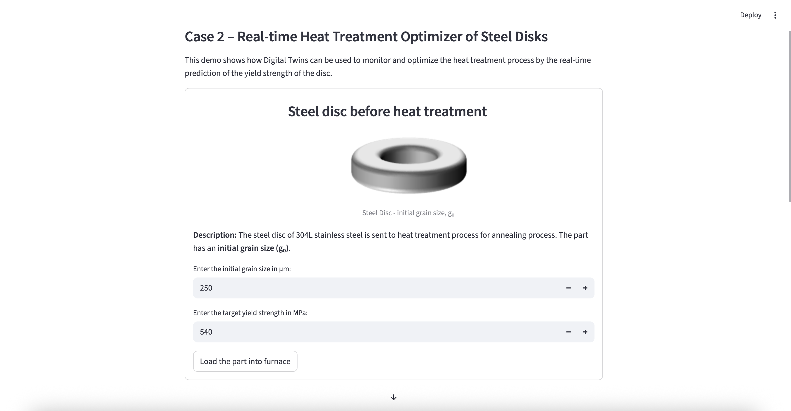
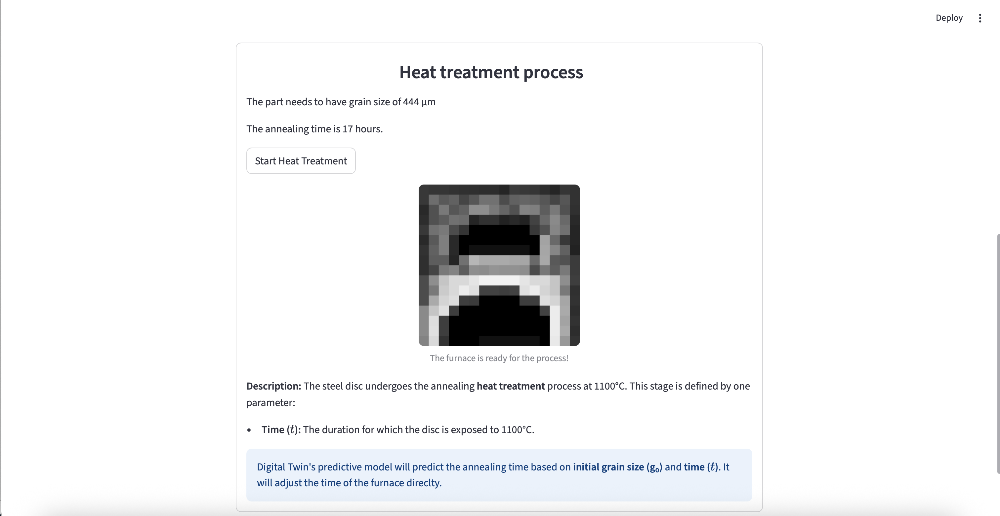
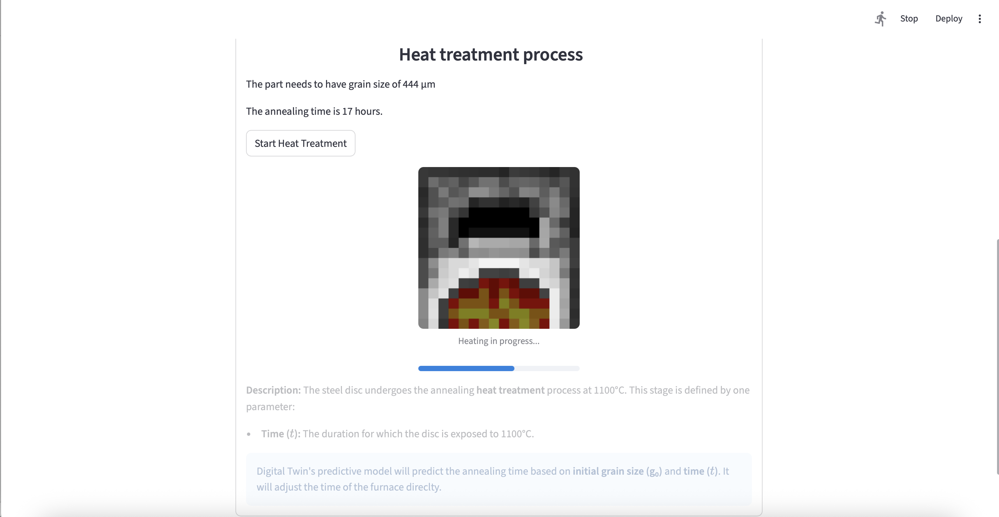
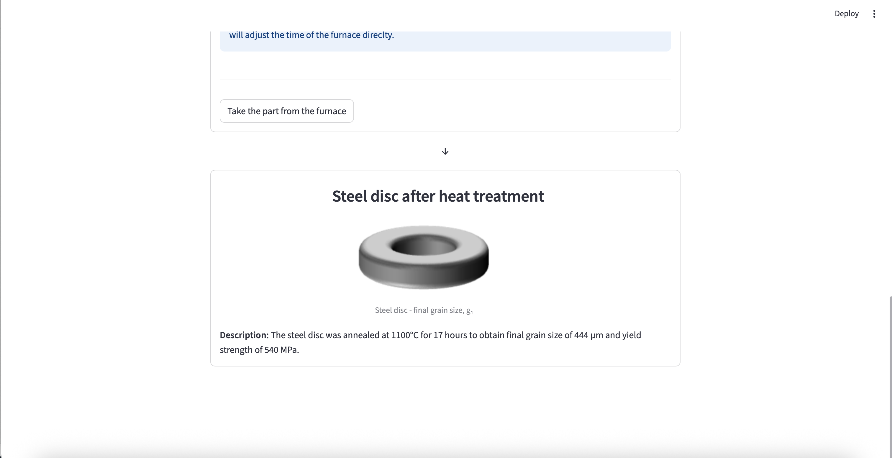

# Real-time Heat Treatment Optimizer of Steel Disks

## Goal
This demo shows how Digital Twins can be used to monitor and optimize the heat treatment process by the real-time prediction of the final grain size of the disc with a target yield strength.

In this example, the annealing heat treatment of a disc of 304L stainless steel is considered. The dependence of grain size on time and the dependence of yield strength on grain size are taken into account to formulate the digital twins. 

The whole digital twin is implemented as a web application for cerating an interactive tool to play with.

This example is expected to be a simple demonstration of a digital twin in materials science.

## Methodology
The target yield strength of the disc part determined by the customer (end product design) and the initial grain size of the disc part (assume that it is measured before the heat treatment) are taken as input in the first step. Then, the grain size that the disc after heat treatment must have (final grain size) is predicted according to Hall-Petch equation. According to the final and initial grain size of the disc, the time that the part needs to spend in the annealing step is calculated by the relation between grain sizes and time.

The whole digital twin was created by streamlit python library with a few lines of markdown codes. 

<p align="center">
  

<p align="center">
  

<p align="center">
  

<p align="center">
  
## How to use

A conda environment must be created by installing the libraries in the requirement.txt file in this environment. In this file, the libraries of torch can be neglected for this example. After installing the libraries, in the terminal of that environment, you can run the command of streamlit applications like ```streamlit run ./app.py```.